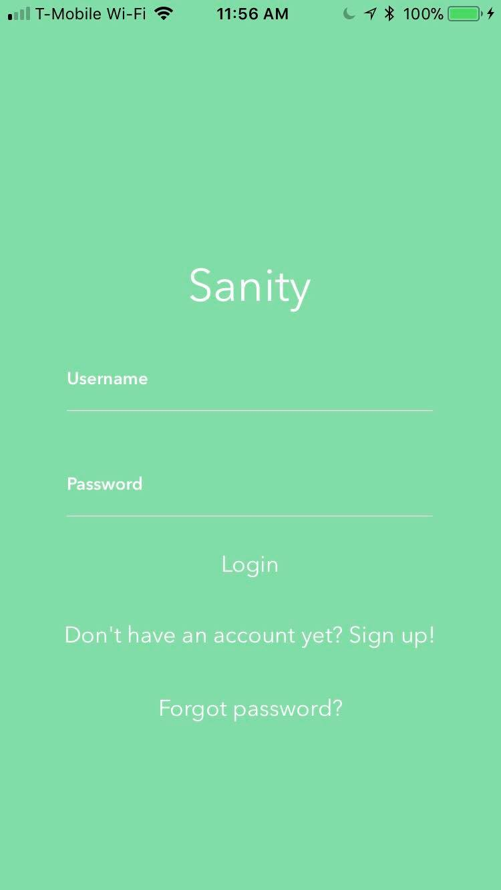
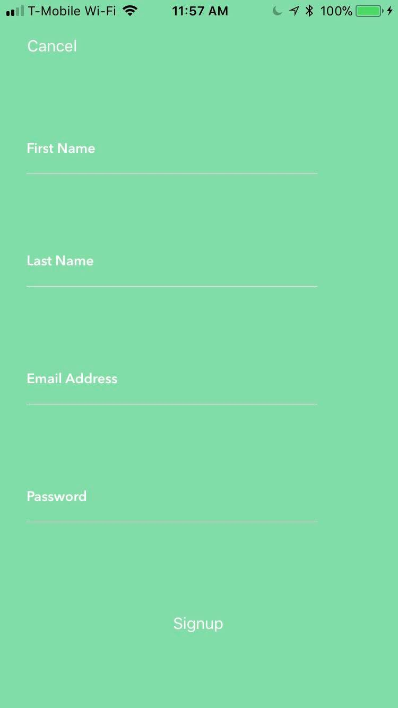
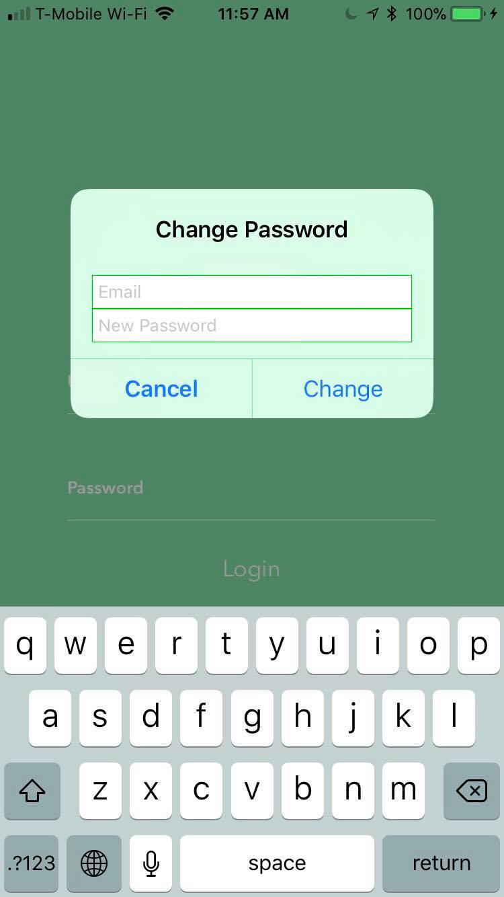

# Sanity

 
 

# Overview
$anity is an iOS app that consollidates financial information into one location and determines how much money you are spending, alerting you if you are going over your allocated budget.

# Set-Up
Follow the installation instructions of [Ngrok](https://ngrok.com/)

# Screenshots
Login Screen: 

Sign-up Screen:

Incorrect Password:

## License

    Copyright [2017] [Aneel Yelamanchili]

    Licensed under the Apache License, Version 2.0 (the "License");
    you may not use this file except in compliance with the License.
    You may obtain a copy of the License at

        http://www.apache.org/licenses/LICENSE-2.0

    Unless required by applicable law or agreed to in writing, software
    distributed under the License is distributed on an "AS IS" BASIS,
    WITHOUT WARRANTIES OR CONDITIONS OF ANY KIND, either express or implied.
    See the License for the specific language governing permissions and
    limitations under the License.
